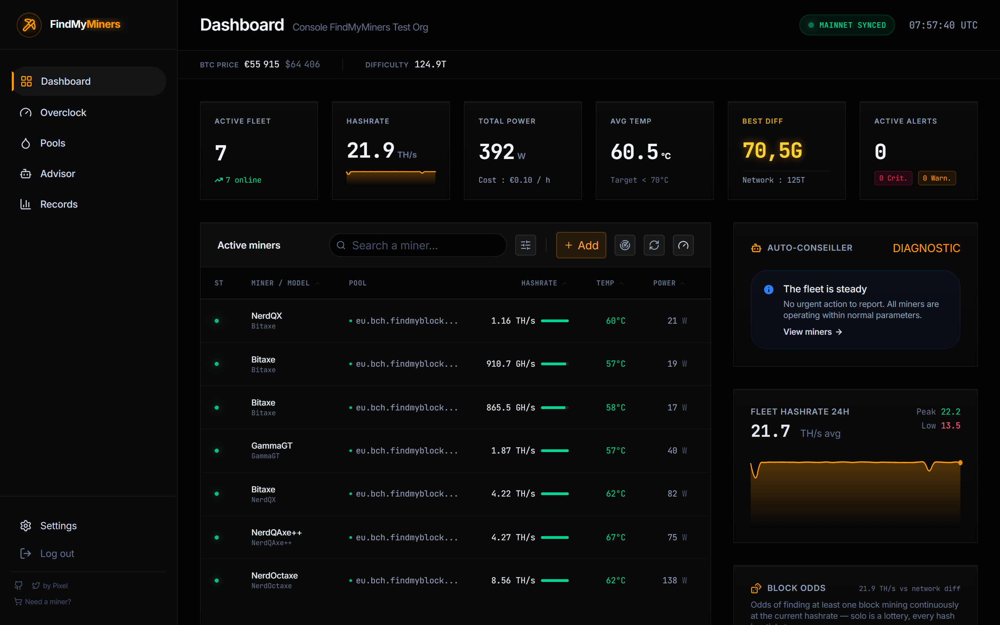

*🇬🇧 English · 🇫🇷 [Français](README.fr.md)*

# FindMyMiners

[](LICENSE)
[](https://github.com/Pixelpow/findmyminers/releases)


Self-hosted dashboard to monitor and control your solo Bitcoin miners: Bitaxe,
NerdAxe, Avalon Nano, and any AxeOS or CGMiner device. Open source, built for
home miners. English UI by default, with a one-click FR/EN switch.

It discovers the miners on your local network, watches them in real time, and
lets you control the whole fleet from a single screen.



## Features

- **Real-time dashboard**: fleet KPIs, sortable table, 24h hashrate, per-miner reboot
- **Network discovery**: automatic scan, or add a miner manually by IP
- **Pools**: catalog of verified solo pools, real TCP ping, apply a pool to the
  whole fleet in one click
- **Overclock & undervolt**: per-chip profiles, undervolting and time scheduling
- **Advisor**: prioritized actions (thermal, hashrate drift, offline miners)
- **Records**: best shares per miner and per account
- **Alerts**: thermal, hashrate drop, pool down — Discord/Slack webhook, Telegram,
  browser push notifications
- **Optional Windows agent** for remote networks

> Solo-mining focused: profitability estimates are hidden by default (you can
> enable them in Settings). The dashboard highlights your best difficulty instead.

## Docker install (recommended)

```bash
git clone https://github.com/Pixelpow/findmyminers.git
cd findmyminers
docker compose up -d --build
# → http://localhost:3000
```

To scan the LAN without an agent, uncomment `network_mode: host` in
`docker-compose.yml` (Linux). Data persists in the `findmyminers-data` volume.

## Windows without Docker (portable zip)

1. Download `FindMyMiners-win64.zip` from the [Releases](../../releases)
2. Unzip anywhere
3. Double-click `Demarrer-FindMyMiners.bat` → your browser opens at
   `http://localhost:3000`

Node.js is bundled — no installation required. No login is required (self-hosted
local mode); your data stays in `app\data`.

## Development

```bash
npm install
npm run dev     # http://localhost:3000
```

Requires Node.js ≥ 24 (storage uses the native `node:sqlite` module).
Copy `.env.example` to `.env.local` for a quick local start without an account.

## Supported miners

Each miner family is an isolated *driver* (`src/server/drivers/`).
Adding a miner means adding one file — see [docs/DRIVERS.md](docs/DRIVERS.md).

| Driver | Protocol | Read | Control |
|---|---|---|---|
| `axeos` | HTTP 80 (Bitaxe, NerdAxe, NerdQAxe, PiAxe, QAxe…) | ✅ | ✅ fan, frequency, voltage, pool, reboot |
| `cgminer` | TCP 4028 (Avalon Nano/Mini, generic) | ✅ | ✅ fan, mode, target temp, pool, reboot |
| `antminer` | TCP 4028 (BMMiner) | ✅ | contributions welcome |
| `whatsminer` | TCP 4028 (btminer) | ✅ | contributions welcome |

## Environment variables (optional)

```bash
LOCAL_MODE=1                 # self-hosted, no-login mode (default in the zip)
AGENT_SHARED_KEY=            # shared key between dashboard and agent
ALERT_WEBHOOK_URL=           # Discord/Slack webhook
ALERT_TELEGRAM_BOT_TOKEN=    # + ALERT_TELEGRAM_CHAT_ID for Telegram
ALERT_TEMP_THRESHOLD_C=90
ALERT_HASHRATE_DROP_RATIO=0.7
```

## Contributing

Contributions are welcome, especially Antminer/Whatsminer control and new drivers.
See [CONTRIBUTING.md](CONTRIBUTING.md) and [docs/DRIVERS.md](docs/DRIVERS.md).

## License

[MIT](LICENSE)
